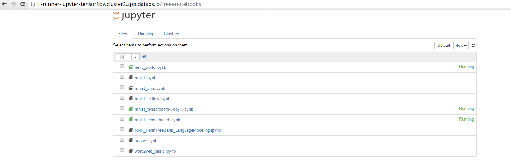

以下是创建tensorflow集群的步骤:

1. 使用k8s_tf.yaml文件创建tensorflow集群。执行oc create -f k8s_tf.yaml后将会创建两个parameter servers和三个workers   
   
   

2. 使用oc create -f tf_tensorboard.yaml创建tensorflow面板, 执行oc expose svc tf-runner-board后会创建访问面板的router，登录这个router就可以访问面板，如下图所示：   
   

3. 使用oc create -f runner_jupyter.yml创建jupyter面板，执行oc expose svc tf-runner-jupyter后会创建访问面板的router，登录这个router就可以访问jupyter面板。如下图所示：   

4. 使用oc create -f runner_fileserver.yml创建tensorflow文件操作面板，文件操作面板展示的是tensorflow容器内的所有文件，可以方便用户对tensorflow相关文件进行浏览和下载。如下图所示：     
    

以下是使用tensorflow的示例:    
tensorflow集群自带一些示例，我们可以使用这些自带示例来使用tensorflow。      
1  执行命令：$oc rsh tf-runner-jupyter-643y7(this is pod name)    
2  执行命令：$cd /distributed ，可以看到如下图所示的示例:       
   

3  执行命令：./start_tf.sh 2 2 mnist_cnn.py    
命令中第一个参数是worker的数量，值必须小于等于所创建的worker数量        
命令中第二个参数是parameter server的数量，值必须与所创建的parameter server数量相等       
命令中第三个参数是要运行的程序        
运行过程与结果如下图所示：         
         

4  tensorflow默认将日志保存在/tmp/dist-mnist-log下，但是tensorflow面板初始化时要读取/log下的内容，所以我们可以手动创建/log目录，执行cp -r /tmp/dist-mnist-log /log将内容拷贝到/log下，确保打开tensorflow面板时有数据可读      

5 登录tensorflow面板，进入GRAPH标签页下，可以看到上面执行的图表结果，如下图所示：        
 

